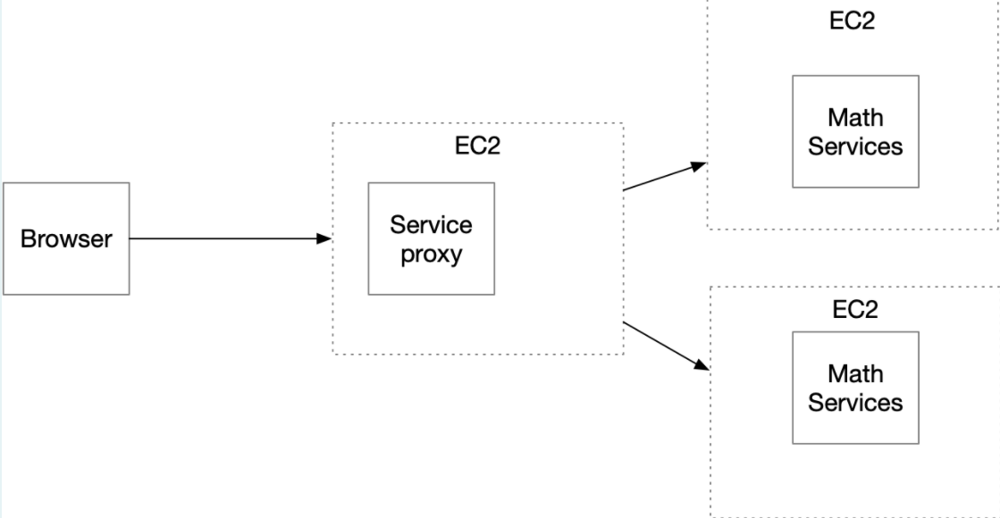

# Parcial 2 Tercio - Ejercicios de Diseño
### Juan Camilo Gil Vargas

Diseñe un prototipo de calculadora de microservicios que tenga un servicios de matemáticas con al menos dos funciones implementadas y desplegadas en al menos dos instancias virtuales de EC2. Además debe implementar un service proxy que recibe las solicitudes de servicios y se las delega a las dos instancias usando un algoritmo de round-robin. Asegúrese que se pueden configurar las direcciones y puertos de las instancias en el porxy usando variables de entorno del sistema operativo. Cada estudiante debe seleccionar para desarrollar dos funciones matemáticas de acuerdo a los dos últimos dígitos de su cédula como se especifica en la lista (Si sus dos últimos dígitos de su cédula son el mismo use el siguiente dígito que sea diferente). Todas las funciones reciben un solo parámetro de tipo "Double" y retornan una parámetro de tipo "Double".

1. ln
2. acos

Implemente los servicios para responder al método de solicitud HTTP GET. Deben usar el nombre de la función especificado en la lista y el parámetro debe ser pasado en la variable de query con nombre "value".

El proxy debe delegar el llamado a los servicios de backend. El proxy y los servicios se deben implementar en Java usando Spark.

## Ejemplo de un llamado:

EC2 
* https://amazonxxx.x.xxx.x.xxx:{port}/cos?value=3.141592

Salida. El formato de la salida y la respuesta debe ser un JSON con el siguiente formato

{

"operation": "cos",

"input":  3.141592,

"output":  -0.999999

}